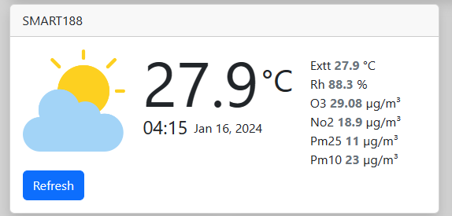
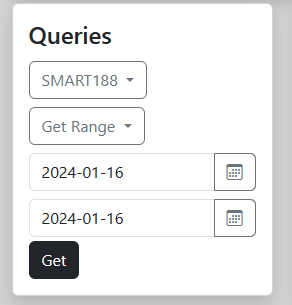
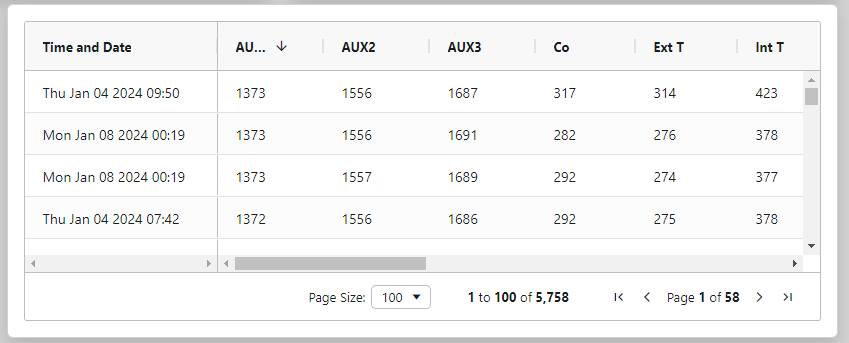

# Aq54

Ce project à été developé avec [Angular CLI](https://github.com/angular/angular-cli) version 17.0.9.

## Vue d'ensemble 

L'application AQ54 permet de visualiser les données des capteurs `SMART188` et `SMART189` 
cette visualisation est de 2 types: 

### le mode temps reel 

Le mode temps réel diffuse les données actuelle de chacun des capteurs et les actualise chaque `minute`.
il est cependant possible d'actualiser manuellement l'affichage entre 2 actualisations automatiques. Cela en cliquant sur le bouton `Refresh`.

### le mode différé

Le mode différé qui permet de recupérer les données recueillies par un capteur sur un intervalle de temps donné. 
en renseignant les champs obligatoires de la carte `Queries` puis en cliquant sur le bouton qui n'apprait en dessous des champs qu'après remplissage.

Les données de la requête apparaissent ainsi dans un tableau

Le mode différé permet aussi le téléchargement des données en fichier CSV en choisisant le type `Get Hourly AVG (CSV)`

## Auteur

Youssoufou SEKONGO\
yousekongo@gmail.com

## conteneurisation 

(voir le fichier [`README.Docker.md`](README.Docker.md))
